# 🧬 DNA Fountain: Digital Data Storage in DNA

<div align="center">


[](https://www.python.org/)
[](https://github.com/Felixburton7/CSE-487-Advanced-Systems-and-Synthetic-Biology-)
[](LICENSE)

*Converting digital information into DNA sequences for next-generation data storage*

</div>

## 📋 Table of Contents
- [Project Overview](#-project-overview)
- [DNA Digital Storage Concept](#-dna-digital-storage-concept)
- [Implementation Details](#-implementation-details)
- [Getting Started](#-getting-started)
- [Repository Structure](#-repository-structure)
- [DNA Encoding Process](#-dna-encoding-process)
- [Technical Visualization](#-technical-visualization)
- [Future Directions](#-future-directions)
- [Contributing](#-contributing)
- [License](#-license)
- [Contact](#-contact)

## 🌟 Project Overview

The DNA Fountain project explores the cutting-edge field of DNA-based digital storage systems. As conventional storage media approach their physical limits, DNA offers a revolutionary alternative with exceptional data density (1 exabyte per cubic millimeter) and longevity (thousands of years).

This implementation demonstrates the complete process of encoding digital data into DNA sequences and the subsequent decoding procedure using the DNA Fountain algorithm, which employs Luby Transform codes for robust error correction.

## 🧪 DNA Digital Storage Concept

DNA digital storage works by converting the binary code of digital data (0s and 1s) into the four nucleotide bases of DNA (A, T, G, C). This project implements the DNA Fountain technique, which adds several innovations:

```mermaid
graph LR
    A[Digital Data] -->|Binary Conversion| B[Droplets]
    B -->|Luby Transform| C[Encoded Droplets]
    C -->|DNA Mapping| D[DNA Sequences]
    D -->|Synthesis & Sequencing| E[Physical DNA]
    E -->|Sequencing| F[Read DNA]
    F -->|Decode| G[Original Data]
    
    style A fill:#f9d5e5,stroke:#333,stroke-width:2px
    style D fill:#d4f1f9,stroke:#333,stroke-width:2px
    style G fill:#d5f9e5,stroke:#333,stroke-width:2px
```



## 💻 Implementation Details

This Python implementation demonstrates:

| Component | Description | Purpose |
|-----------|-------------|---------|
| **Data Encoding** | Conversion of digital data to DNA-compatible format | Prepares data for storage in biological media |
| **Luby Transform** | Fountain code implementation for reliable data recovery | Enables recovery from incomplete sets of sequences |
| **DNA Sequence Processing** | Handling of DNA droplets and nucleotide conversion | Manages the encoding/decoding between binary and DNA |
| **Error Handling** | Detection and correction of errors in DNA sequences | Improves reliability in the presence of synthesis/sequencing errors |
| **Decoding Pipeline** | Recovery of original data from DNA sequences | Completes the storage and retrieval process |

## 🚀 Getting Started

### Prerequisites

- Python 3.x
- Required Python packages:
  ```bash
  pip install numpy pandas biopython pygments
  ```

### Running the Project

1. **Clone the repository**:
   ```bash
   git clone https://github.com/Felixburton7/CSE-487-Advanced-Systems-and-Synthetic-Biology-.git
   cd CSE-487-Advanced-Systems-and-Synthetic-Biology-
   ```

2. **Execute the main script**:
   ```bash
   python DNA_Fountain_Project_1.py
   ```

3. **Optional: Generate documentation**:
   ```bash
   # Convert to HTML with syntax highlighting
   pygmentize -f html -O full,style=colorful -o DNA_Fountain_Project_1.html DNA_Fountain_Project_1.py
   
   # Convert HTML to PDF (requires Pandoc and MiKTeX)
   pandoc DNA_Fountain_Project_1.html -o DNA_Fountain_Project_1.pdf
   ```

## 📁 Repository Structure

```
CSE-487-Advanced-Systems-and-Synthetic-Biology-/
├── DNA_Fountain_Project_1.py      # Main implementation script
├── luby_blocks.csv                # CSV file with Luby Transform blocks data
├── README.md                      # Project documentation
└── docs/                          # Documentation files (optional)
    ├── DNA_Fountain_Project_1.html  # HTML documentation
    └── DNA_Fountain_Project_1.pdf   # PDF documentation
```

## 🧬 DNA Encoding Process

The encoding process follows these key steps:

```python
# Example code snippet demonstrating the DNA encoding process
def encode_to_dna(binary_data):
    # Map binary pairs to nucleotides: 00->A, 01->C, 10->G, 11->T
    mapping = {'00': 'A', '01': 'C', '10': 'G', '11': 'T'}
    dna_sequence = ""
    
    for i in range(0, len(binary_data), 2):
        if i+1 < len(binary_data):
            pair = binary_data[i:i+2]
            dna_sequence += mapping[pair]
    
    return dna_sequence

# Process droplets using Luby Transform
def create_droplets(data, num_blocks, num_droplets):
    droplets = []
    for i in range(num_droplets):
        # Choose random degree d
        d = choose_degree(num_blocks)
        # Choose d random blocks
        block_indices = random.sample(range(num_blocks), d)
        # XOR the blocks together
        droplet_data = create_droplet_data(data, block_indices)
        # Add indices and data to droplet
        droplets.append((block_indices, droplet_data))
    
    return droplets
```

## 📊 Technical Visualization


*Figure: Visualization of the DNA Fountain encoding and decoding process*

The DNA Fountain algorithm achieves remarkable efficiency by:

1. **Robust Encoding**: Using fountain codes (LT codes) to create redundant droplets
2. **Screening**: Filtering out sequences with undesirable properties
3. **Error Correction**: Enabling recovery even when some sequences are lost or damaged

## 🔮 Future Directions

Potential extensions and improvements for this project:

- **Real DNA Integration**: Connect with laboratory DNA synthesis and sequencing
- **Optimization**: Improve encoding efficiency and error correction capabilities
- **Scalability Testing**: Evaluate performance with larger datasets
- **Compression**: Implement pre-encoding compression to maximize storage density
- **GUI Interface**: Develop a user-friendly interface for encoding/decoding operations

## 👥 Contributing

Contributions are welcome! Here's how you can help:

1. Fork the repository
2. Create a feature branch: `git checkout -b feature/amazing-feature`
3. Commit your changes: `git commit -m 'Add some amazing feature'`
4. Push to the branch: `git push origin feature/amazing-feature`
5. Open a Pull Request

Please ensure your code follows the project's style and includes appropriate tests.

## 📄 License

This project is licensed under the MIT License - see the LICENSE file for details.

## 📬 Contact

**Felix Burton** - [felixburton2002@gmail.com](mailto:felixburton2002@gmail.com)

Project Link: [https://github.com/Felixburton7/CSE-487-Advanced-Systems-and-Synthetic-Biology-](https://github.com/Felixburton7/CSE-487-Advanced-Systems-and-Synthetic-Biology-)

---

<div align="center">
  <sub>Store the digital world in a drop of DNA 🧬</sub>
</div>
